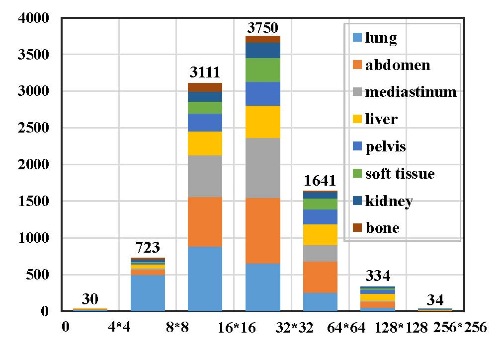

## Delving into Universal Lesion Segmentation: Method, Dataset, and Benchmark

This paper has been published in ECCV 2022.

This code is licensed for non-commerical research purpose only.

### Introduction

Most efforts on lesion segmentation from CT slices focus on one specific lesion type. However, universal and multi-category lesion segmentation is more important because the diagnoses of different body parts are usually correlated and carried out simultaneously. The existing universal lesion segmentation methods are weakly-supervised due to the lack of pixel-level annotation data. To bring this field into the fully-supervised era, we establish a large-scale universal lesion segmentation dataset, SegLesion. We also propose a baseline method for this task. Considering that it is easy to encode CT slices owing to the limited CT scenarios, we propose a Knowledge Embedding Module (KEM) to adapt the concept of dictionary learning for this task. Specifically, KEM first learns the knowledge encoding of CT slices and then embeds the learned knowledge encoding into the deep features of a CT slice to increase the distinguishability. With KEM incorporated, a Knowledge Embedding Network (KEN) is designed for universal lesion segmentation. To extensively compare KEN to previous segmentation methods, we build a large benchmark for SegLesion. KEN achieves state-of-the-art performance and can thus serve as a strong baseline for future research.


### SegLesion

- [SegLesion-Data Collection and Annotation] We select 9816 lesions in 9624 CT slices from DeepLesion and carefully label them with pixel-level masks using the online annotation tool of Polygon-RNN++(http://www.cs.toronto.edu/~amlan/demo/). To ensure the accuracy and reliability, we conduct a triple-check annotation process, and the third annotator is an experienced doctor. Moreover, we abandon some CT slices with lesions whose boundaries are fuzzy for accurate recognition or whose masks are too small to label manually. Finally, SegLesion is composed of 9623 lesions in 9456 CT slices from 4321 series of 3178 studies of 1356 unique patients.
- [SegLesion-Data Statistics] All CT slices in SegLesion are in a resolution of $512\times 512$. The distribution of the lesion sizes is shown in below, from which we can see that most lesions only occupy a small part of the whole image. In detail, about 71.3\% of lesions have a size ranging from 64 pixels to 1024 pixels.

The number of lesions whose sizes are over 4096 ($64\times 64$) pixels is 368, only accounting for 3.8\% of all lesions in SegLesion. Among all lesions, the smallest one only has 8 pixels, and the largest one has 57161 pixels, occupying 21.8\% of the entire image. We also plot a height vs width figure for all lesions.

It is easy to see that the lesions in SegLesion are very small in general. We plot the locations of center points of lesions. We can observe that the lesions are randomly distributed on the CT slices without bias, indicating the universal property of SegLesion.

Following DeepLesion, we coarsely divide the 9456 CT slices of SegLesion into eight types, including lung (2346), abdomen (2099), mediastinum (1619), liver (1193), pelvis (834), soft tissue (647), kidney (479), and bone (239), as depicted in below.


### Citations

If you are using the code/model provided here in a publication, please consider citing:
   
    @inproceedings{qiu2022delving,
    title={Delving into Universal Lesion Segmentation: Method, Dataset, and Benchmark},
    author={Qiu, Yu and Jing, Xu},
    journal={Proceedings of the European conference on computer vision (ECCV)},
    year={2022}
    }

### Requirements

The code is built with the following dependencies:

- Python 3.6 or higher
- CUDA 10.0 or higher
- [PyTorch](https://pytorch.org/) 1.2 or higher

### Data Preparation
The SegLesion can be downloaded:
- [BaiDuYun](https://drive.google.com/file/d/19JQ919DJw8CVs0xuUsLEffAugzlpbOHN/view?usp=sharing)
- [GoogleDrive](https://drive.google.com/file/d/19JQ919DJw8CVs0xuUsLEffAugzlpbOHN/view?usp=sharing)

*The SegLesion dataset is organized into the following tree structure:*
```
dataset
│
└───images
└───masks
└───val__masks
└───test_masks
└───train_set.txt
└───val_set.txt
└───test_set.txt
└───test_set_type.txt
└───class_set.txt
'''
```


### Testing
The pretrained model of KEN can be downloaded:
- [VGG16](https://drive.google.com/file/d/1DIk1hdhNKPqQuu0o1u2ZJEnImhreRvFn/view?usp=sharing)
- [KEN-VGG16](https://drive.google.com/file/d/1DIk1hdhNKPqQuu0o1u2ZJEnImhreRvFn/view?usp=sharing)
- [ResNet50](https://drive.google.com/file/d/1wynnHTR3i28O-Fpf8CK3qNnYbCjVt__M/view?usp=sharing)
- [KEN-ResNet50](https://drive.google.com/file/d/1wynnHTR3i28O-Fpf8CK3qNnYbCjVt__M/view?usp=sharing)

Run the following scripts to test the model:
```Shell
./FastSal/test.sh [--pretrained ./results_mod50/KEN_ResNet.pth]
                [--file_list test_set.txt]
                [--savedir ./output/]
```


### Evaluate

Run the following scripts to evaluate the model:
```
python evaluate.py
```

### Training
Run the following scripts to train the model:

```Shell
./FastSal/train_resnet.sh [--cached_data_file ./duts_train.p]
                [--max_epochs 50]
                [--num_workers 4]
                [--batch_size 16]
                [--itersize 1]
                [--savedir ./results]
                [--lr_mode poly]
                [--lr 1e-4]  
```

### Contact

For any questions, please contact me via e-mail: yqiu@mail.nankai.edu.cn.
